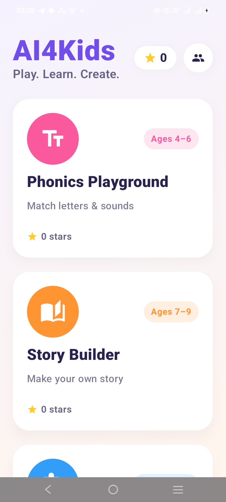
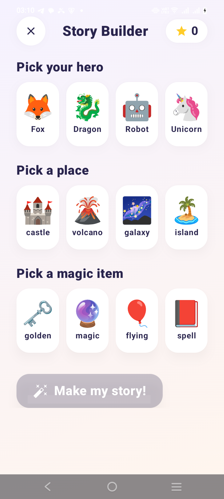
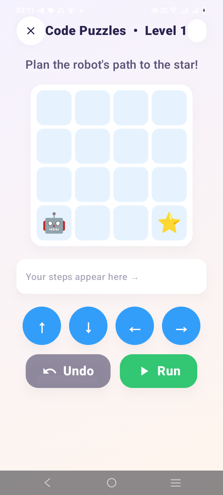
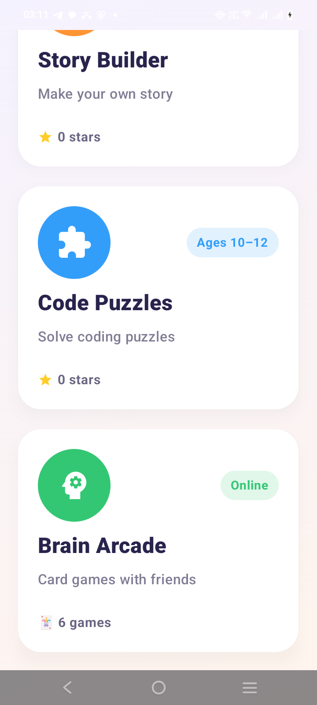

<div align="center">

# 🎨 AI4Kids — Android

[](https://kotlinlang.org)
[](https://developer.android.com/jetpack/compose)
[-3DDC84?logo=android&logoColor=white)](https://developer.android.com)
[](https://developer.android.com)
[](https://gradle.org)

**Play. Learn. Create.** — a bright, friendly activity app for young learners (ages 4–16)

[Website](https://ai4kids.tertiarycourses.com.sg) · [iOS counterpart](https://github.com/alfredang/ai4kidsapp) · [Report Bug](https://github.com/alfredang/ai4kids_android/issues)

</div>

## Screenshots

<div align="center">

| Home | Story Builder | Code Puzzles | Brain Arcade |
| :---: | :---: | :---: | :---: |
|  |  |  |  |

</div>

## About

**AI4Kids for Android** is the native Kotlin + Jetpack Compose port of the
[AI4Kids iOS/iPadOS app](https://github.com/alfredang/ai4kidsapp). It's a colourful,
kid-first learning app built around bright activity cards on a single home screen.
Kids earn ⭐️ stars for completing rounds, the home header keeps a running total, and a
**Parents' Corner** explains the privacy stance and can reset progress.

The core learning activities are **offline-first** — no login, progress stored locally on
the device. **Phonics Quest** (spoken "Buddy" hints) and **Story Builder** (freshly-written
tales) can optionally call Google **Gemini** when an API key is set; both stay fully playable
offline without it. The **Escape Room** is a top-down puzzle adventure (built with
LibGDX) you can play solo offline or **co-op** with friends over a room code. The **Brain
Arcade** adds **online multiplayer card games**. Co-op Escape and the Brain Arcade need a
sign-in and an internet connection; everything else works fully offline.

### Activities

| Activity | Ages | What it does | Connectivity |
| --- | --- | --- | --- |
| 🔤 **Phonics Quest** | 4–6 | An adventure map of phonics "worlds" — listen to sounds, build words, find rhymes; spoken with on-device TextToSpeech | Offline (+ optional AI) |
| 📖 **Story Builder** | 7–9 | Pick a hero, a place & a magic item; the app weaves a short illustrated story | Offline |
| 🧩 **Code Puzzles** | 10–12 | Sequence arrow steps to walk a robot 🤖 to the star ⭐️ (algorithmic thinking) | Offline |
| 🚪 **Escape Room** | 7–12 | Walk a top-down room, solve a chain of mini-puzzles and escape; five themed rooms, solo or co-op | Offline (solo) · Online (co-op) |
| 🧠 **Brain Arcade** | All | Ten **card games** — play solo, co-op, or versus friends | Online |

### Phonics Quest — the five worlds

A map of phonics "worlds"; clearing one (≥1 star) unlocks the next, and each world earns up
to **3 stars**. Letters, sounds and words are spoken on-device (`TextToSpeech`). When a
Gemini key is configured, an **"Ask Buddy"** button adds a kid-friendly hint and the
completion screen reads out personalized praise.

| World | Game | Skill |
| --- | --- | --- |
| 🅰️ **Letters Land** | Pop the Phoneme | Hear three numbered sounds, pick the starting sound (letter hidden) |
| 🌉 **Blend Bridge** | Build the Word | Spell a short word from shuffled letter tiles |
| 🤫 **Whisper Woods** | Build the Word | Spell words with **silent letters** (lamb, knife, ghost…) |
| 🎵 **Rhyme Road** | Rhyme Time | Pick the picture/word that **rhymes** with the target |
| 👑 **Story Kingdom** | Listen & Find | Hear a word, choose it among **similar-sounding** words |

### Escape Room — the five themed rooms

A top-down adventure built with **LibGDX** (it runs as its own `Activity` and returns the
stars earned). You walk a character around a small grid of rooms, solving a chain of
mini-puzzles — number locks, symbol ciphers, word searches, crosswords, fog-of-war mazes,
step-ordering, sorting and circuit-rotating — to unlock the exit. A **lobby** lets you play
solo, or host/join **co-op** with a room code (teammates' solves unlock the same gates for
everyone, routed through the same backend as the Brain Arcade). Each room has its own
themed floor, backdrop and scenery.

| Room | Theme | Highlights |
| --- | --- | --- |
| 🤖 **Robot Lab** | How machines learn | Count the robots, decode symbols, a word-search display, order the "how AI learns" steps |
| 🦸 **Superhero Tower** | Kindness & Morality | Carry charged "core" values (kind/true/fair) to the Superhero Suit; an honesty maze + fairness share |
| ♻️ **Green Workshop** | Recycling & green energy | A solar-power quiz, a recycling chain, a **circuit**, all feeding the exit cipher |
| 🏛️ **History Vault** | Singapore history | Recover heritage artefacts behind history puzzles and place them in the Time Capsule |
| 🦁 **Lion City Carnival** | Singapore culture | Solve culture rooms, drag the words into a **crossword**, then spell the secret word in symbols |

### Brain Arcade — the ten card games

Each game is created/joined with a room code and validated server-side (the backend is
authoritative). Modes vary per game: **Solo**, **Co-op**, and **Versus**.

| Game | Idea | Modes |
| --- | --- | --- |
| ➕ **Make Ten** | Tap two cards that add up to exactly 10 to clear the board | Solo |
| 🐾 **Animal Count** | An animal lights up — race the timer to tap the card with that many | Solo |
| 🔎 **Odd One Out** | Four cards match, one doesn't — find it before the timer runs out | Solo |
| 🔡 **Alphabet Lock** | Flip nine hidden letters in alphabetical order, from memory | Solo |
| 🧠 **Memory Match** | Flip two cards, match each word with its picture | Solo · Co-op · Versus |
| 🃏 **Tower Tumble** | Stack cards higher on four piles; play a 10 to topple a tower | Solo · Versus |
| 🔢 **Number Hunt** | Discard cards that equal — or add/subtract to — the target number | Solo · Versus |
| 🎲 **Beat the Die** | Roll the die, then play cards that add up to at least the roll | Solo · Versus |
| ⭐ **Card Showdown** | Secretly play cards, reveal at once, clash for victory stars | Versus |
| 🌈 **Matching Colours** | Memorise colour→number, then race to tap the right colour | Versus |

## Tech Stack

| Category | Technology |
| --- | --- |
| **Language** | Kotlin 2.0.21 |
| **UI** | Jetpack Compose + Material 3 (Compose BOM 2024.09.03) |
| **Game engine** | LibGDX 1.13.1 (the Escape Room — a self-contained `AndroidApplication`) |
| **Architecture** | Single-Activity Compose home; the Escape Room runs as a separate LibGDX `Activity`; shared state via `CompositionLocal` |
| **Audio** | Android `TextToSpeech` (on-device, offline) for Phonics |
| **AI (optional)** | Google Gemini API (`gemini-2.5-flash`) for the Phonics Buddy |
| **Networking** | OkHttp 4.12.0 (Brain Arcade + optional Phonics AI) |
| **Auth** | NextAuth credentials flow, session cookie persisted locally |
| **Persistence** | `SharedPreferences` (activity + phonics stars, best times, session cookie) |
| **Build** | Gradle (Kotlin DSL), Android Gradle Plugin 8.5.2 |
| **SDK** | Min SDK 24 (Android 7.0) · Target/Compile SDK 34 · JVM 17 |

## Architecture

```
┌──────────────────────────────────────────────────────────────┐
│                        MainActivity                            │
│   enableEdgeToEdge · CardApi.init · provides ProgressStore     │
└───────────────────────────────┬──────────────────────────────┘
                                 │
                          ┌──────▼───────┐
                          │  RootScreen  │  home grid + star total
                          └──────┬───────┘
       ┌──────────┬──────────┬───┴──────┬─────────────┬──────────────┐
       ▼          ▼          ▼          ▼             ▼
 ┌──────────┐┌──────────┐┌──────────┐┌───────────┐┌──────────────┐
 │ Phonics  ││  Story   ││   Code   ││  Escape   ││ Brain Arcade │
 │(TTS +AI) ││(offline) ││(offline) ││(solo/coop)││   (online)   │
 └──────────┘└──────────┘└──────────┘└─────┬─────┘└──────┬───────┘
   offline activities award stars          │ co-op       │
   via ProgressStore                       ▼             ▼
                                    ┌──────────────────────────────┐
                                    │     EscapeApi  /  CardApi      │
                                    │    OkHttp + cookie session     │
                                    └───────────────┬───────────────┘
                                                    │ HTTPS
                                                    ▼
                                  ai4kids Next.js backend (NextAuth ·
                              co-op escape rooms · /api/learn/cards/{create,
                                       join, start, move, sync})
```

## Project Structure

```
app/src/main/java/sg/com/tertiarycourses/ai4kids/
├── MainActivity.kt              # Entry point; CardApi.init + shared ProgressStore
├── model/Activity.kt            # The home activities (title, color, age band, icon)
├── data/ProgressStore.kt        # Local star tally, persisted to SharedPreferences
├── ai/
│   └── GeminiClient.kt          # Optional Gemini calls for the Phonics Buddy
├── ui/
│   ├── theme/Theme.kt           # Brand palette, shapes, shadows, background gradient
│   ├── RootScreen.kt            # Home grid of activity cards + Brain Arcade tile
│   ├── ParentsCornerSheet.kt    # Privacy info + reset progress
│   ├── components/SharedUI.kt   # KidButton, StarBadge, CloseButton, CelebrationView
│   └── activities/
│       ├── StoryBuilderScreen.kt
│       ├── CodePuzzlesScreen.kt
│       └── phonics/             # Phonics Quest
│           ├── PhonicsContent.kt   # 5 worlds + per-stage star store
│           ├── PhonicsGames.kt     # Mini-games + TextToSpeech speaker + Gemini Buddy
│           └── PhonicsScreen.kt    # Adventure map + stage host
├── cards/                       # Online "Brain Arcade" card games
│   ├── CardApi.kt               # OkHttp client: NextAuth login + card endpoints
│   ├── CardGameMeta.kt          # Catalogue of the ten games + modes
│   ├── CardModels.kt            # CardState and related models
│   ├── CardBoards.kt            # Per-game board rendering
│   ├── BrainArcadeScreen.kt     # Hub + lobby
│   ├── CardGameScreen.kt        # In-game screen
│   ├── LoginScreen.kt           # Sign-in for online play
│   └── LocalSolo.kt             # Offline solo play + local best times
├── escape/                      # Escape Room lobby + co-op session
│   ├── EscapeLobbyScreen.kt     # Solo / host / join a co-op room
│   ├── EscapeApi.kt             # Co-op room endpoints
│   └── CoopSession.kt           # Shared solved-set polling for teammates
└── gdx/                         # Escape Room game (LibGDX)
    ├── EscapeActivity.kt        # AndroidApplication host; returns stars earned
    ├── EscapeGdxGame.kt         # The five levels, rooms, puzzles and rendering
    └── GdxToolkit.kt            # Asset-free helpers (anti-aliased shapes, rich text)
```

## Getting Started

### Prerequisites

- **Android Studio** (Koala or newer) with the Android SDK
- **JDK 17** (bundled with recent Android Studio)
- An Android device or emulator running **Android 7.0 (API 24)** or higher

### Clone & run

```bash
git clone https://github.com/alfredang/ai4kids_android.git
cd ai4kids_android
```

Open the project in **Android Studio**, let it sync Gradle, then run the `app`
configuration on an emulator or device.

From the command line:

```bash
./gradlew assembleDebug      # build a debug APK
./gradlew installDebug       # install on a connected device/emulator
```

> If the Gradle wrapper jar is missing, run `gradle wrapper` once (or let Android
> Studio regenerate it) to produce `gradle/wrapper/gradle-wrapper.jar`.

### Brain Arcade backend (optional)

The online card games default to the production backend
(`https://ai4kids.tertiarycourses.com.sg`). For local development against a Next.js dev
server, the app permits cleartext to `10.0.2.2`, `localhost`, and `127.0.0.1` (see
`res/xml/network_security_config.xml`); the base URL is stored in `SharedPreferences`.
A valid AI4Kids account is required to sign in for online play.

### Phonics AI (optional)

Phonics Quest's "Buddy" uses Google Gemini for spoken hints and praise. It's **off by
default**; to enable it, add your key to `local.properties` (git-ignored):

```properties
GEMINI_API_KEY=your_key_here
```

Leave it blank and the phonics games still work fully offline (just without the AI Buddy).

## Privacy

- **Code Puzzles** and the **solo** Escape Room request **no network** and collect **no data**.
- **Story Builder** and **Phonics Quest** are offline by default. When a Gemini API key is
  configured they can call Google's **Gemini** API: Story Builder sends the chosen
  ingredients (hero, place, item, mood) to write a story, and Phonics Quest's **"Buddy"**
  sends a short prompt for a hint when the child taps "Ask Buddy". With no key, both run
  fully on-device.
- `INTERNET` / `ACCESS_NETWORK_STATE` permissions are used by Brain Arcade's online card
  games, **co-op** Escape rooms, and the optional Gemini features (Story Builder + Phonics
  Buddy).
- The only persisted data is local: star progress, solo best times, and (when signed in)
  the online session cookie — stored **encrypted** (Android Keystore) and excluded from
  backup/transfer.

## Contributing

1. Fork the repository
2. Create a feature branch (`git checkout -b feature/amazing`)
3. Commit your changes (`git commit -m 'Add amazing feature'`)
4. Push to the branch (`git push origin feature/amazing`)
5. Open a Pull Request

Conventions: keep parity with the iOS source where practical, keep the UI 100% Compose,
and award stars through `ProgressStore.award(count, activity)` so totals persist.

## Developed By

**Tertiary Infotech Academy Pte. Ltd.** — [tertiarycourses.com.sg](https://www.tertiarycourses.com.sg)

## Acknowledgements

- Built with [Jetpack Compose](https://developer.android.com/jetpack/compose) and
  [Material 3](https://m3.material.io)
- Networking by [OkHttp](https://square.github.io/okhttp/)
- Android port of the [AI4Kids iOS app](https://github.com/alfredang/ai4kidsapp)

---

<div align="center">

⭐️ Star this repo if AI4Kids helped a young learner play, learn, and create!

</div>
